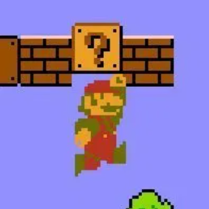

# **서론**
지난 시간에는 ApplicationLayer 클래스와 System 인터페이스 클래스, 그리고 플랫폼별 클래스들의 구현과 팩토리 메소드를 사용한 생성 방법에 관해서 이야기를 하였다. 이번 포스트에선 GameLayer에 관해서 자세히 설명하고자 한다.
파트 1을 아직 읽지 않은 사람들은 우선, 지난 포스트를 읽고 오길 바란다.
<br>
<br>

# **게임 레이어**
게임 레이어는 게임내에서 동작하는 물리, 프로세스, 이벤트, 그리고 현재 게임의 상태 같은 것들을 관리하는 중요한 레이어이다. 관리되는 항목들을 간단히 설명하자면...

## **게임 물리**
게임 물리는 게임 월드 내에 있는 오브젝트들이 서로 어떻게 상호작용을 하는지에 대한 규칙을 관리한다. 현실 세계의 물리 법칙과 최대한 흡사하게 만드는 것도 좋은 생각이지만, 재미를 위해서 간혹 게임마다 어울리는 새로운 물리 규칙들을 만들곤 한다. 이 두 방법은 서로 장단점이 존재한다. 현실적인 물리 규칙을 구현하면, 플레이어가 각각의 오브젝트들이 어떤 상호작용을 일으킬지 쉽게 예상할 수 있고, 여러 선택지를 취할 수 있게 해준다. 하지만 유저에게 즐거운 경험을 주지 못할 수도 있다. *`슈퍼 마리오 브라더스`* 를 예로 들어 설명하자면, 마리오가 점프를 하고 주먹으로 블록을 때리면, 간혹 아이템이 나오곤 한다.

<p align="center">

<br>
박치기가 아니라 주먹으로 박살내는거였다 
</p>

현실이었다면, 손뼈도 같이 박살 나 몇 주간 깁스를 차고 있어야 할 것이다. 또 높은 곳에서 떨어져 두 다리 뼈가 부러지면 병원에 당분간 입원 해야 할 것이다. 이게 게임에 고스란히 구현되면, 플레이어에게 그리 좋은 경험을 전달할 순 없을 것이다.

<!-- - 게임 물리: 게임 월드내에 있는 오브젝트들이 서로 어떻게 상호작용을 하는지. 현실의 물리 법칙과 최대한 흡사하게   
           만드는것도 좋지만, 게임의 재미를 위해서 여러 규칙들을 바꾸는 것도 좋음. 현실적인 물리를 구현하면, 
           유저가 어떤 상호작용이 일어날지 쉽게 예상할 수 있어, 여러 선택지를 취할 수 있다. 하지만, 높은 
           곳에서 떨어져 다리 뼈가 뿌러지고 몇주간 병원에 입원해야하는 등의 사실성까지 포함하면, 좋은 게임 
           플레이 경험은 아닐것이다. -->
<br>

## **게임 이벤트**
게임 안에선 다양한 이벤트가 발생한다. 그리고 이벤트의 종류들은 게임에 따라 셀 수도 없이 많은 조합이 존재한다. 예를 들어, 숨어있던 플레이어를 적 AI가 발견하고, 동료들에게 알리거나, 혹은 곧바로 공격하는 이벤트와 플레이어가 특정 구역에 들어갔더니 문이 잠기고, 몬스터들이 튀어나올 수도 있다. 게임 상태(Game State)를 이벤트 시스템과 연결해놓을 수 있다. 주의할 점은 게임 상태는 다른 시스템들의 저장소와 마찬가지이기 때문에, 다른 여러 시스템이 서로 직접 커플링 되지 않도록 유지하는 것이 중요하다는 것이다.
<!-- 
- 게임 이벤트: 게임 내에서 발생할 수 있는 여러 이벤트들. 예를 들어, 플레이어 캐릭터의 체력이 적을때, 낮은 체력
             임을 나타내는 애니메이션이 실행되거나, 적 AI들이 행동하는 패턴이 달라지거나 하는 등의 상호작용.
             Game State를 이벤트 시스템과 연결 해놓는것은 좋은 생각.
             Game State는 다른 시스템들의 저장소와 마찬가지임으로, 다른 여러 시스템들이 서로 직접적으로
             커플링 되지 않도록 유지하는것이 중요. -->

<br>

## **게임 프로세스**
게임 프로세스는 게임 내에서 여러 프레임에 걸쳐 일어나는 행동이나 절차를 말한다. 예를 들어, 캐릭터가 특정 좌표까지 이동하는 행동이나, AI 유닛들의 길 찾기 프로세스 같은 것들이다. 여러 게임 프로세스들을 엮어 새로운 게임 프로세스를 만들 수도 있다. 게임 프로세스의 지원은 게임 엔진의 강력한 기능이 될 것이다. 앞서 설명한 게임 이벤트를, 여러 게임 프로세스들을 만드는 데 사용할 수 있다.

<!-- - 게임 프로세스: 게임 프로세스는 게임 내에서 여러 프레임에 걸쳐 일어나는 모든 행동이나 절차.
               예) 캐릭터가 특정 좌표까지 이동하는 행동이나, AI들의 길찾기 행동을 취하는 것들.
               여러 게임 프로세스들을 엮어 새로운 게임 프로세스를 만드는 등, 굉장히 강력한 기능이 될 것.
               게임 이벤트가 이런 프로세스들을 만드는데 사용될 수 있음. -->


<br>

## **게임 상태**
Game State는 간단히 말해 게임마다 다루는 규칙들과 세부 항목들의 집합을 말한다. 게임의 현재 상황, 장르에 따라 다양한 Game State가 존재할 수 있다. 큰 항목으로 예제를 말하자면, 게임의 타이틀을 보여주는 상태, 게임 플레이를 보여주는 상태, 크레딧 화면을 보여주는 상태가 있을 수 있다. 또한, 세부적으로 들어가면, 존재하는 아이템, AI, 배경 오브젝트, 그리고 해당 레벨의 목표에 따라 다양한 상태가 존재한다.

<br>

## **게임 상태 관리하기**
게임 레이어가 하는 중요한 역할 중 하나는 게임 상태를 지속해서 확인해주는 것이다. 게임마다 다양한 규칙과 다양한 세부항목으로 이루어진 게임 상태들이 존재할 수 있으므로, 모든 종류의 게임에 적용할 수 있는 완벽한 솔루션을 존재하지 않는다. 그러니 게임이 제대로 동작할 수 있는 적당한 방식을 사용하면 된다. 게임 상태 관리가 그렇게 중요한 사항이 아니라면, 배열이나 해쉬 맵 같은 기존에 널리 알려진 자료구조를 사용하는 것만으로도 충분하다.

그렇지 않다면, CPU와 메모리 사용률을 고려해서 설계하면 된다. 사용 가능한 로컬 메모리의 양이 충분하다면, CPU 사용률을 줄이기 위해 여러 자료구조들의 사용을 고려해볼 수 있다. 모바일 게이밍 환경에선, CPU 사용률을 줄일수록 배터리 사용량 또한 줄일 수 있다. 여기서 주의해야 할 점은, `너무 이른 최적화는 모든 악의 뿌리(Premature Optimization is the Root of All evil)`라는 것이다. 게임의 모든 부분을 최적화 하려다 오히려 게임을 완성하지 못하고 포기하는 경우를 간혹 보곤 했다. 항상 성능과 생산성 사이 `적당한` 수준을 유지하도록 하자. 만들고 있는 게임이 느려지기 시작하면, 그때 프로파일링을 한 뒤, 그 원인을 찾고 최적화를 하면 된다.


<!-- - 게임 레이어가 하는 중요한 일: 게임의 상태를 계속 확인하는 작업.
- Game State: 게임마다 GameState에서 다루는 항목이 다를 수 있어, 완벽한 솔루션은 없음. 게임이 제대로 작동하는 것이 가장 중요하니 적당한 방식을 사용하면 된다. 성능이 중요한 사항이 아니라면, 보통 배열, 해쉬 맵 같은 기존에 널리 알려진 자료 구조를 사용하는 방법으로도 충분하다.
- 컴퓨팅에 있어 주요한 트레이드-오프는 속도와 메모리 사용량. 
  메모리가 넉넉하다면, CPU 사용률을 줄이기 위해서 여러 자료구조중 고려해보는것도 좋음.
  모바일 게이밍 환경에선, CPU 사용률을 줄이면 배터리 사용량 또한 줄일 수 있음.
- 게임이 느려지기 시작할때 프로파일링 후, 게임이 느려지게 하는 원인을 최적화을 하면 된다. 예를 들면, CPU 사용률이 너무 높으면, 메모리 사용률을 높이면 되고, 반대로 메모리 사용률이 너무 높으면 CPU 사용률을 높이면 된다. 처음 부터 모든 항목을 최적화 하려고 하지 말고, 항당 '적당히'를 유지하자. 너무 이른 최적화는 모든 악의 뿌리(Premature Optimization Is the Root of All Evil)임을 꼭 기억하자.


- 단 한개의 Game State만이 게임의 제어에 대한 권한을 가지고 있어야한다. 이는 여러 플레이이어간 월드 동기화를 유지하는데 필요하다.  -->

# **코드를 봅시다** 
## **GameLayer 인터페이스 선언**
```cpp
/*
*  GameLayer.h
* 
*  Copyright (c) 2020 Junyoung Kim. All rights reserved.
*/

class IGameLayer
{
public:
    virtual ~IGameLayer() = 0 {}
    virtual std::string_view GetGameName() const = 0;
};
```
간단한 뼈대 인터페이스이다. 이제 앞서 설명한 게임 레이어가 관리할 항목들과 초기화, 업데이트 함수등 꼭 필요한 기능들을 추가하면, 아래와 같이 된다.

```cpp
/*
*  GameLayer.h
* 
*  Copyright (c) 2020 Junyoung Kim. All rights reserved.
*/
class IGameLayer
{
protected:
    Camera2D         m_camera;
    EventManager     m_eventManager;
    ProcessManager   m_processManager;

    std::unique_ptr<IPhysicsManager> m_pPhysicsManager;

public:
    virtual ~IGameLayer() = 0 {}
    virtual std::string_view GetGameName() const = 0;

    virtual bool Initialize() {}
    virtual void Update(float deltaTime) {}

    EventManager&       GetEventManager()       { return m_eventManager; }
    Camera2D&           GetCamera()             { return m_camera; }
    IPhysicsManager&    GetPhysicsManager()     { return *(m_pPhysicsManager.get()); }
};
```
실제 Beluga 엔진에는 더 많은 내용들이 들어가 있지만, 이 포스트에선 초기에 필요한 뼈대만을 작성했다. 앞서 설명한 게임 레이어가 관리하는 항목들을 넣어주면 된다.

이렇게 작성한 뒤, 이전에 작성한 `ApplicationLayer`에 게임 레이어를 생성하는 팩토리 메소드를 넣어두면 된다.
```cpp
/*
*  ApplicationLayer.h
*
*  Copyright (c) 2020 Junyoung Kim. All rights reserved.    
*/

class ApplicationLayer
{
private:
    std::unique_ptr<IGameLayer> m_pGameLayer;

public:
    virtual std::unique_ptr<IGameLayer> CreateGameLayer() = 0;
};
```

생성 부분을 구현한 뒤, `Initialize()` 함수에서 생성후, 초기화 하는 과정을 거치면 된다. 종료시 `Shutdown()` 함수에서도 처리를 해줘야하는 것을 잊지말자.

그 뒤, 게임 프로젝트 파트에서 `ApplicationLayer`와 `IGameLayer`를 상속받는 클래스를 만들어주면된다.
```cpp
/*
* Game.h
*
* Copyright (c) 2020 Junyoung Kim. All rights reserved.
*/
#pragma once
#include <ApplicationLayer.h>

// 실제 게임의 로직을 담당하는 클래스
// 만들려는 게임에 사용할 로직들을 넣으면 된다.
class GameLogic : public IGameLayer
{
public:
    virtual ~GameLogic() override {}
    virtual std::string_view GetGameName() const override
    {
        return "Game";
    }

    virtual bool Initialize() override
    {
        return true;
    }

    virtual void Update(float deltaTime)
    {
    }
};

class GameApp : public ApplicationLayer
{
public:
    virtual ~GameApp() override {}
    virtual std::unique_ptr<IGameLayer> CreateGameLayer() override
    {
        return std::make_unique<GameApp>();
    } 
}
```

여기까지 하면, 핵심적인 엔진 구조는 완료한 것과 마찬가지이다. 이제 남은 것은 각자 게임에 맞는 기능들을 추가하면 된다.
