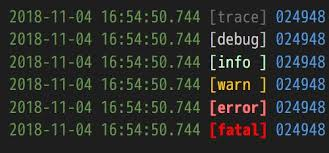

# 서론 (이 포스트에서 다룰 내용.)
포스트들이 Beluga-Engine에 개발하는 동안 있었던 배웠던 내용이나, 이야기가 아니라 그냥 전반적인 엔진 개발에 필요한 지식인것 같다는 피드백을 받았다. 앞으로 포스트에 Beluga-Engine에 적용한 내용의 양을 늘려보려고 한다.

지난 포스트까지 엔진의 틀을 MVC 구조를 응용하여 나누고, 각 레이어들이 다룰 역활을 이야기 했다. 이제 엔진에 추가할 기능들을 개발할때 가장 중요한 툴에 대해서 이야기 해보고자 한다. 소프트웨어 개발 과정 동안, 디버거나 유닛 테스트로는 사전에 잡을 수 없는 문제들이 발생하곤 한다. 특히 게임을 개발하다보면 이런 경우가 많다. 여러 프레임에 걸쳐서 오류가 발생하는 시스템일 경우 디버깅을 하는 동안 언제 문제가 발생하는지 정확한 타이밍을 발견하기 힘들며, 발생하지 않을 수도 있다. 또한, 3D 그래픽스 처럼 수백만개의 정점들을 다뤄야하는 경우 디버깅 툴로 하나 하나 손을 찾는건 불가능에 가깝다. 게임 디자이너나 아티스트들의 작업 환경에는 디버깅 툴이 없는 경우도 다반사다.

이런 상황에서 우리를 구원해주는 툴이 바로 '로깅'이다. 로깅은 한 사건의 목격자이다. 한 코드가 작동하거나, 글리치나 크래쉬가 발생하기전 어떤 단계들이 거쳐졌는지 보여주어, 프로그래머로 하여금 어떤 일이 일어났는지 알수 있게 해주는 아주 고마운 툴이다. 

# 로그 메시지를 남기는 방법
가장 간단하지만 효과적인 로깅 방법은 바로 ***printf statement***를 활용하는 방법이다. 이걸 C/C++ 프로그래머들은 ***printf debugging***이라고 부른다. 이 방법이라면, 따로 로깅 클래스를 만들어서 로그 메시지를 남겨본 경험이 없더라도, 프로그래밍을 공부하는 동안 한번쯤을 써봤을 것이다. 모든 게임 플랫폼에는 콘솔이나 TTY(teletype) 같은 아웃풋 장치가 있다. 예를 들면

- Win32나 Linux 환경에서 C/C++로 콘솔 어플리케이션을 작성할때, C++ 스탠다드 라이브러리의 **`iostream`** 인터페이스, 혹은 **`printf()`**, **`fprintf()`**를 이용해 콘솔에 결과물을 출력할 수 있다.

- 불행히도, 게임이 Win32 기반의 윈도우 어플리케이션이면, 이 방법은 통하지 않는다. 결과를 출력할 콘솔창이 존재하지 않기 때문이다. 하지만, Visual Studio Debugger를 사용한다면, Win32의 **OutputDebugString()**을 통해 메시지를 통해 메시지를 출력할 수 있는 디버그 콘솔을 제공한다.

- PlayStation3와 PlayStation4에선 *Target Manager* (혹은 *PlayStateion Neighborhood*)라는 프로그램 통해 개발하는 게임을 콘솔에서 실행시킬 수 있게 해준다. *Target Manager*는 TTY 출력창을 가지고 있는데, 게임 엔진에서 이곳에 메시지를 출력할 수 있게 해준다. 

    - 미러링 로깅
         * 참조: Game Engine Architecture 3/E p.592

++ 로그 메시지를 너무 많이 남기는 경우 vs 로그 메시지를 너무 적게 남기는 경우

# 로그 메시지 다듬기
기본적으로 로그 메시지는 프로그래머가 정의한 raw string이다. 하지만 이것만으론, 어느 시스템 관련인지, 중요한 메시지 인지 아닌지 구분할 수 없다. 이에 메시지에 구조를 두어 사용자가 알아보기 쉽게 하는것이 중요하다. 구조를 두기위에 사용되는 항목에는 여러가지가 존재한다.

아래와 같은 로그 메시지가 좋은 예다.

 이미지 출처:   
이거 spdlog라는 오픈소스 로깅 시스템의 로그 출력 사진이다. 사진을 자세히 보면, 로그 메시지가 발생한 날짜와 발생한 시각을 제일 먼저 보여주고. 로그 메시지의 중요도를 색상으로 구분하여 보여주고 있다. 그 뒤, 메시지의 본문을 보여주고 있다. 

또 다른 좋은 로깅 시스템의 예로는 유니티 엔진의 로깅 시스템이 있다. 

 이미지 출처: https://docs.unity3d.com/Manual/Console.html  
유니티의 로깅 시스템을 보면, 로그 메시지의 중요도를 아이콘으로 나타내고 있다. 또한 로그 메시지가 발생한 시각과 로그 메시지의 발생 지점의 스크립트와, 열 번호를 알려준뒤, 메시지 본문을 보여주고 있다. 유니티 환경에서 보통 대부분의 경우 `Debug.Log()`를 통해서 메시지를 출력하기 때문에, 로그 메시지의 레벨을 지정하지 못한다고 생각하는 사람들이 꽤 있는데, 유니티 또한 메시지 레벨을 지정하여 로그 메시지를 출력할 수 있다. 자세한 내용은 이 [링크](https://docs.unity3d.com/ScriptReference/Logger-filterLogType.html)를 참조해보자.

이 처럼 로그 메시지를 다듬기 위한 여러가지 추가 정보가 붙을 수 있다. 이 포스트에선 로그의 중요도 레벨 와 이를 활용해 특정 레벨 이상의 메시지를 무시하는 방법에 대해서 다뤄보겠다.

## 로그 메시지의 중요도 레벨 (Severity Level)
중요도 레벨는 로그 메시지를 읽는 사람으로 하여금, 해당 메시지를 무시해도 되는 수준인지, 게임을 강제 종료 시켜야할만큼 중요한 수준인지 알수 있게 해준다. 각 태그들은 임의로 활성화/비활성화가 가능하며, 이를 활용하여 특정 태그들의 로그 출력을 막을 수 도 있다. 가장 기본적인 레벨로는 *error*, *warning*, **info**가 있다. 이 레벨을 활용하여, 레벨에 따라 출력하는 방식을 다르게 할 수 있다. 예를 들어, *error* 레벨의 경우 그냥 메시지를 출력하는것이 아니라, dialog box로 로그 메시지를 화면 정중앙에 나오게 할 수도 있다.

**warning**은 **error**보다는 덜 긴급한 메시지이다. 무시되어서는 안되는 메시지임에는 동일하지만, **error**처럼 Dialog box를 만들면서까지 출력하진 않고, 콘솔에서만 출력되도 무방한 레벨이다. 

**info** 레벨은 마찬가지로 콘솔에 출력되는 로그 메시지이지만, **error**나 **warning** 처럼 함수, 파일명, 코드의 라인 번호등 다른 디버그 정보들을 포함하지 않는 메시지이다.

모든 로그 메시지들은 하나의 태그에 묶여져서 출력되어져야한다. 앞서 제시한것들은 엔진측에서 하드 코딩되는 레벨들다. 유저가 직접 레벨을 정의 할 수 있도록 두고, 태그에 따라 메시지가 다뤄줘야하는 방향을 결정할 수 있도록 하면 된다.

## 로그 메시지 거르기 (Verbosity)
중요도 레벨을 활용하면, 무시해도 되는 수준을 메시지를 관리할 수 있다. 예를 들어 개발 진행동안 **Debug** 혹은 **Info** 태그의 로그 메시지들이 출력 되도 되지만, 릴리즈 버전에선 출력되지 않아도 된다면, 해당 레벨의 로그 메시지를 소스 코드에서 컴파일을 전부 제외하거나, 지우는 방법으로 출력을 방지할 수 있다. 하지만 이 방식은 굉장히 비효율적이다. 이때 로그 레벨에 따른 메시지 출력을 제한하는 것을 **vebosity 수치**(the level of verbosity)라고 부른다.

# 로그 메시지의 종류
    - 인 게임 로그 메시지 (HUD 상에서)
    - 게임 리포트

# 로그 메시지 채널링
        * 참조: Game Engine Architecture 3/E p.592
                Game Coding Complete 4/E p.831
                Programming Game Engines M02

++ 로그를 여러 시스템 레벨로 나누어서, 자세한 내용을 출력하도록 하거나, 간단한 메시지를 출력하도록 하거나

# 로그 메시지에 전달 되야하는 내용들.
    - 플레이어의 입력
        * 참조: Programming Game Engines M02
    - 코드내 로그 메시지가 출력된 위치
        * 참조: Programming Game Engines M02
    - 로그 메시지가 발생한 시간과 날짜(Time Stemp)
        * 참조: Programming Game Engines M02
    - 스택 트레이스
    - 충돌 보고 (Crash Reports)
        * 참조: Game Engine Architecture 3/E p.594
    - 

# 쓰레드 세이프한 로깅 클래스 만들기
    * 참조: Game Coding Complete 4/E p.832
           Professional C++ 4/E

참조
Game Engine Architecture 3/E p.592 ~ 
Game Coding Complete 4/E p.828 ~ 835
